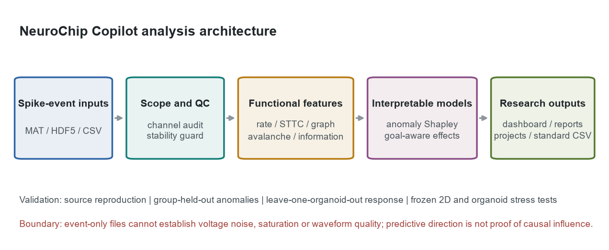
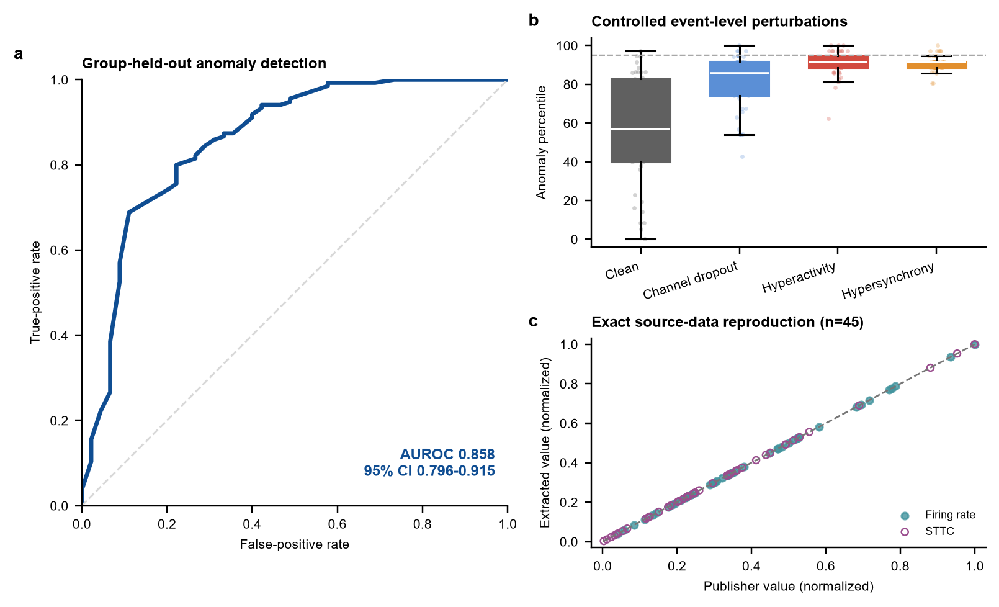
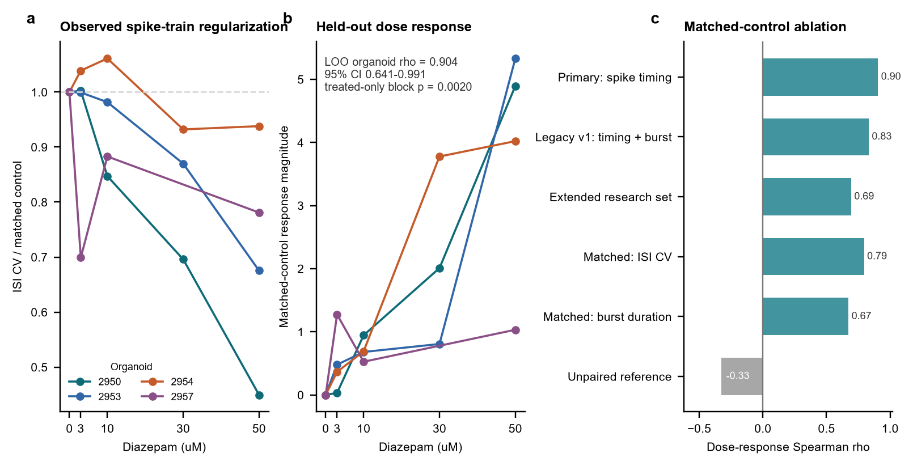
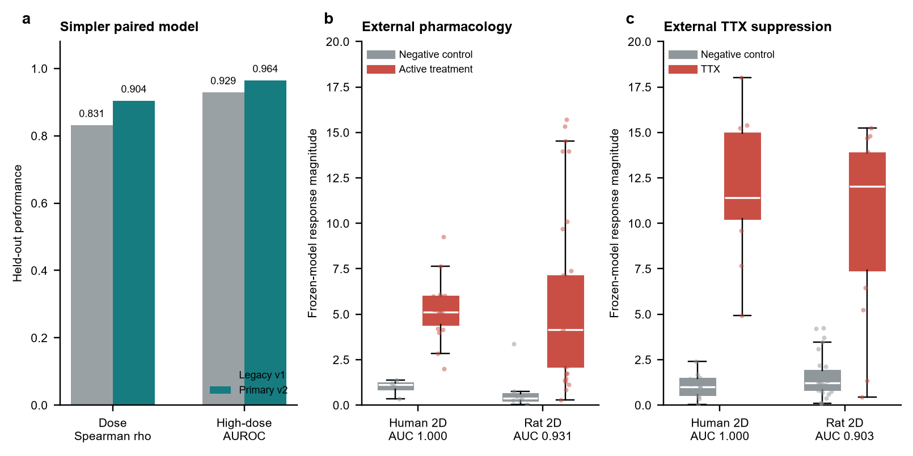

# NeuroChip Copilot

**Quality-aware electrophysiology phenotyping and multidimensional intervention evaluation for neural organ chips and brain organoids.**

NeuroChip Copilot is a runnable research system for detected extracellular spike events. It ingests MATLAB, HDF5, or event-table CSV files; audits channels and recording stability; extracts classical and research-grade activity, synchrony, burst, graph, neuronal-avalanche, and information-flow descriptors; explains anomaly and intervention effects; and exports an interactive dashboard, PDF/HTML reports, standardized event tables, and persistent projects. Its paired-response score is retained as an auxiliary measure of change magnitude rather than a stand-alone efficacy or toxicity endpoint.

**Competition declaration:** `End-to-End System` in [AI4S Open Innovation: AI for Life Science](https://www.kaggle.com/competitions/ai-4-s-open-innovation-artificial-intelligence-for-life-scien/overview). The end-to-end scope begins with detected MEA spike events and ends with QC evidence, functional phenotyping, multidimensional matched-intervention evaluation, reports, and project history. The preliminary deadline is 10 October 2026; entrants must also complete the registration form linked from the official overview.



## What is validated

- **Source-data reproduction:** firing rate and 20 ms spike time tiling coefficient (STTC) matched all 45 publisher rows with maximum absolute errors of `8.88e-16` and `1.11e-16`, respectively.
- **Group-held-out anomaly detection:** five-fold GroupKFold by 16 source groups achieved AUROC `0.858` (cluster-bootstrap 95% CI `0.796-0.915`) across 45 clean recordings and 135 controlled event-level perturbations.
- **Real diazepam response:** the two-feature v2 model tracked dose with leave-one-organoid-out Spearman `rho=0.904` (cluster-bootstrap 95% CI `0.641-0.991`) across 19 conditions from four organoids. Treated-only `rho=0.803` with blocked-permutation `p=0.0020`; high-dose AUROC was `0.964` (95% CI `0.850-1.000`).
- **Frozen external stress test:** without retraining, the same response magnitude separated active pharmacology from negative controls in 66 matched wells from human iPSC-derived and rat 2D neuronal networks (pooled AUROC `0.952`, 95% CI `0.881-0.997`) and TTX from non-TTX stages (pooled AUROC `0.950`, 95% CI `0.865-1.000`). These data test transfer of response magnitude, not organoid identity or compound dose.
- **Independent cortical-organoid stress test:** the unchanged response model separated six known spike/burst-suppressing treatment pairs from six contemporaneous untreated-control pairs in the Trujillo cortical-organoid data (AUROC `0.889`, 95% CI `0.667-1.000`). Active changes exceeded same-well natural drift in all six matched wells (one-sided Wilcoxon `p=0.0156`). This small external endpoint supports organoid-domain transfer of change detection, not universal efficacy, toxicity, or dose interpretation.
- **Reproducible engineering:** the repository contains checksummed downloads, per-recording checkpoints, fixed random seeds, saved models, automated tests, publication-ready figures, and a one-command full pipeline.







## Run the dashboard

Python 3.11-3.14 is supported.

### Evaluator launch command

After installing the dependencies, the evaluator should run this command from the repository root:

```bash
python demo.py --demo-only
```

This is the **official evaluator entry point**. It starts the dashboard with the lightweight public examples bundled in the submission, so the first demonstration does not require downloading a large external dataset. The dashboard is then available at `http://127.0.0.1:8501` on the evaluator's own computer. On Windows, the evaluator may alternatively double-click [`start_dashboard.cmd`](start_dashboard.cmd).

For a full local reproduction, use [`scripts/reproduce_all.py`](scripts/reproduce_all.py) after reviewing the data licenses and download manifest; that command is not required for the first evaluator demonstration.

Fastest judge path after installing the environment:

```bash
python demo.py --demo-only
```

This forces the six lightweight public examples and two matched pairs bundled with the repository, even on a machine that also contains full source data.

```bash
python -m venv .venv
```

Windows:

```powershell
.\.venv\Scripts\Activate.ps1
python -m pip install -r requirements.txt
streamlit run app.py
```

After the environment is installed, Windows users can also double-click `start_dashboard.cmd`; it starts the local service and opens `http://127.0.0.1:8501`.

Linux or macOS:

```bash
source .venv/bin/activate
python -m pip install -r requirements.txt
streamlit run app.py
```

The repository includes at least one lightweight event-table example from each of the four public data sources, two matched public baseline-treatment pairs, trained model artifacts, and derived validation tables, so the dashboard opens without downloading the full datasets. The three modes are:

1. **Recording analysis:** choose a recording from the forebrain-organoid, diazepam-organoid, GIN 2D-neuron, or Trujillo cortical-organoid public datasets, or upload MAT/HDF5/CSV; review channel/stability QC, raster, classical and advanced features, reference-deviation Shapley evidence, and PDF/HTML reports. A full local data installation exposes 334 public records. The functional-state-axis and reference-deviation percentiles are explicitly labeled by data-domain applicability and are not health, disease, efficacy, or toxicity scores.
2. **Intervention evaluation:** run a bundled matched public pair immediately, or upload two or more records; select baseline, treatment, goal, and optional reference/recovery records; review multidimensional impact, goal alignment, reference distance, network-silencing risk, reversibility, and uncertainty. The legacy paired-response score and dose calibration are auxiliary and exploratory.
3. **Project management:** SQLite-backed project and sample registration for repeat analyses and audit history.

The **Model explanation** tab includes a five-level evidence table generated from checked-in JSON results. It states what each validation layer supports and what it cannot support, so a high AUC is not presented as a universal biological claim.

## Full reproduction

The complete core run downloads and verifies the forebrain-organoid and diazepam datasets, extracts only the required drug-response archive subset, builds features, validates publisher values, trains both models, exports figures and lightweight public assets, builds the technical report, and runs tests. External GIN and Trujillo validation data use their dataset-specific checkpointed workflows because the source files are much larger:

```bash
python scripts/reproduce_all.py
```

Reuse existing per-recording checkpoints:

```bash
python scripts/reproduce_all.py --resume
```

Reuse already downloaded data:

```bash
python scripts/reproduce_all.py --skip-download --resume
```

The full download is approximately 0.9 GB because the CMOS dataset is distributed as one archive. Download URLs, byte sizes, MD5 checksums, licenses, creators, and DOIs are declared in [`data/manifests/datasets.json`](data/manifests/datasets.json).

The GIN external validation is intentionally optional because its source files are separate. After those files already exist locally, reproduce that analysis without any download:

```bash
python scripts/reproduce_all.py --skip-download --resume --with-local-external-validation
```

The optional flag never downloads external data. Its expected source metadata and checksums are in [`data/manifests/external_validation.json`](data/manifests/external_validation.json).

## Input formats

### Event-table CSV

The canonical NeuroChip event table uses:

```text
recording_id,timestamp_s,channel_id,amplitude_uv,duration_s,well_id,source_vendor,schema_version
recording_001,0.102,A,,180,,unknown,1.0
recording_001,0.218,A,,180,,unknown,1.0
recording_001,0.151,B,,180,,unknown,1.0
```

Only timestamp and channel are required for legacy input; aliases such as `time_s`/`channel` and Axion `Time`/`Channel` are recognized. `scripts/convert_to_neurochip.py` performs chunked Axion conversion with SHA-256 metadata, checkpoints, and `--resume`. See [`docs/neurochip_format.md`](docs/neurochip_format.md).

The dashboard performs an upload preflight before analysis: it checks readability, required columns, numeric non-negative timestamps, positive duration, and non-empty event/channel content. It also warns about inferred duration, millisecond-like time values, and multiple wells in one upload. A standard template is available from the upload panel and is stored at [`data/demo/neurochip_event_template.csv`](data/demo/neurochip_event_template.csv).

### MATLAB or HDF5

Supported layouts include:

- MATLAB v7.3/HDF5 files with `spike_times` and optional `amplitudes` plus a `metadata` group.
- Legacy MATLAB files with `spike_times` or a `units` structure containing `spike_train`; sample indices are converted with `sampling_rate` or `fs` when present.

For intervention evaluation, upload at least two files from the same experimental object or matched well, then select the baseline and post-treatment records. The interface performs a format preflight for every file before enabling the comparison.

## Method summary

The primary phenotype model uses 18 normalized functional features. Acquisition duration, raw event counts, amplitude scale, sampling rate, and QC scores are excluded from model input to reduce protocol and device leakage. Median imputation and robust scaling precede PCA and a 500-tree Isolation Forest. The user-facing functional-state-axis and reference-deviation scores are percentiles relative to the public reference cohort; internal fields retain their original names for backward compatibility. A deterministic Monte Carlo single-reference Shapley estimate explains the deviation-score difference from the robust training median.

The multidimensional intervention evaluator compares 18 validated phenotype features after robust scaling. It reports root-mean-square overall impact and five domain summaries spanning activity, timing, synchrony/network, organization, and bursting. A user-selected goal determines whether signed changes are aligned or opposed; without a goal, the system quantifies change only. Reference distance is always reported, network-silencing risk can override an apparently desirable suppression, and an optional recovery record quantifies reversibility. A single pair never receives more than moderate evidence, and advanced avalanche/information-flow changes remain exploratory.

The auxiliary v2 drug model computes signed `log1p` differences between each treatment and its matched zero-dose control for mean ISI coefficient of variation and median ISI. Each component is scaled by its training interquartile range, and the root-mean-square standardized difference measures how strongly the pair changed. The simpler timing model replaced the legacy timing-plus-burst model because it improved both leave-one-organoid-out performance and independent frozen-model stress tests. It does not determine whether a change is beneficial or harmful; isotonic dose calibration remains exploratory.

The feature table also reports recording stability, neuronal avalanche size/duration/branching descriptors, bias-corrected mutual information and transfer entropy, and lag-1 predictive Granger log-variance ratios. These descriptors are exploratory: transfer entropy and Granger direction do not prove synaptic causality. A 30-feature exploratory phenotype model underperformed the validated 18-feature model (`0.839` versus `0.858` grouped-CV AUROC), so advanced descriptors are reported without silently enlarging the primary model.

## Repository layout

```text
app.py                       Streamlit dashboard
demo.py                      Cross-platform one-command competition entry point
src/neurochip/               Readers, QC, features, models, reports, visuals
scripts/                     Download, training, validation, figures, reproduction
data/manifests/              Source, license, checksum, and extraction declarations
data/demo/                   Lightweight redistributable dashboard assets
models/                      Trained public Demo models
tests/                       Unit, data-reader, model, and dashboard tests
docs/                        Report, Writeup, cards, scripts, and figure assets
output/pdf/                  Technical report and one-page sample analysis report
```

## Competition deliverables

The required submission is a Kaggle Writeup with a declared category, a public no-login Demo video of at most five minutes, a public reproducible code repository, and a concise self-contained technical report. The official page recommends approximately 15-20 report pages and evaluates Problem Importance and Potential Impact (30%), Technical Approach and Innovation (30%), Results and Validation (20%), Reproducibility and Implementation Quality (10%), and Presentation Quality (10%).

The workspace contains a captioned `4:29.70` Chinese Demo video from the previous interface, an independent SRT subtitle file, a rendered technical report, the Kaggle Writeup draft, four competition figures, and a sample PDF report. The final video and submission archives remain pending refresh until the user declares the system final. Rebuild them after all source and deliverable changes:

```bash
python scripts/build_submission_package.py
python scripts/audit_submission.py
```

The audit verifies frozen headline metrics, report pagination, video duration and resolution, SHA-256 integrity, archive safety, and absence of private paths or credential patterns. It intentionally leaves public video, repository, report, and optional app URLs as entrant-owned actions because those require the competition account holder's identity and publishing accounts.

## Scope and limitations

- Dashboard uploads receive **event-level** QC. Inactive event channels are called candidates, not dead electrodes. The library also provides `assess_raw_voltage_quality(...)` for noise, drift, line-noise, saturation, and dead-channel screening when true voltage arrays and sampling frequency are supplied; event files alone cannot support those claims.
- The reference cohort contains brain organoids measured with MEA platforms; transfer to another neural organ-on-chip geometry or laboratory requires local controls and external validation.
- The anomaly benchmark uses controlled synthetic perturbations and is not a disease, clinical, toxicity, or efficacy classifier.
- The diazepam cohort contains four organoids and one compound. External evidence adds two 2D neuronal-culture domains and a small 12-pair cortical-organoid endpoint; it is not a prospective multi-site or cross-compound efficacy validation.
- A favorable or unfavorable intervention label is conditional on the user-selected experimental goal. A single before/after pair cannot replace biological replicates, a matched vehicle/time control, effect uncertainty across preparations, or toxicology assays.
- Mutual information, transfer entropy, and predictive Granger descriptors are statistical associations, not established causal connectivity.
- Joblib model files are Python pickles. Load only files from this repository or models generated locally.

## Data and citation

1. Itatani, N. (2026). *Spontaneous activity spike data and RNA-seq gene expression data from human forebrain organoids*. Zenodo. https://doi.org/10.5281/zenodo.20286251. CC BY 4.0.
2. Sharf, T. (2022). *Extracellular Recordings from Human Brain Organoids Using High-density CMOS Arrays*. Zenodo. https://doi.org/10.25349/D9031Z. CC0 1.0.
3. Sharf, T. et al. Functional neuronal circuitry and oscillatory dynamics in human brain organoids. *Nature Communications* **13**, 4403 (2022). https://doi.org/10.1038/s41467-022-32115-4. PMID: 35906223.
4. Cutts, C. S. & Eglen, S. J. Detecting pairwise correlations in spike trains: an objective comparison of methods and application to the study of retinal waves. *Journal of Neuroscience* **34**, 14288-14303 (2014). https://doi.org/10.1523/JNEUROSCI.2767-14.2014. PMID: 25339742.
5. Kapucu, F. E., Vinogradov, A., Hyvärinen, T., Ylä-Outinen, L. & Narkilahti, S. Comparative microelectrode array dataset of functional development of human PSC-derived and rat neuronal networks. *Scientific Data* **9**, 120 (2022). https://doi.org/10.1038/s41597-022-01242-4. PMID: 35354837. Data DOI: https://doi.org/10.12751/g-node.wvr3jf.
6. Beggs, J. M. & Plenz, D. Neuronal avalanches in neocortical circuits. *Journal of Neuroscience* **23**, 11167-11177 (2003). https://doi.org/10.1523/JNEUROSCI.23-35-11167.2003. PMID: 14657176.
7. Trujillo, C. A. et al. Complex oscillatory waves emerging from cortical organoids model early human brain network development. *Cell Stem Cell* **25**, 558-569.e7 (2019). https://doi.org/10.1016/j.stem.2019.08.002. PMID: 31474560. Data DOI: https://doi.org/10.5281/zenodo.4751759.

## Development disclosure and license

OpenAI Codex assisted software development, testing, and documentation. All reported numerical results are generated by the checked-in deterministic pipeline; the dashboard has no external AI API dependency. Third-party Python packages and public datasets remain under their respective licenses, documented in [`THIRD_PARTY_NOTICES.md`](THIRD_PARTY_NOTICES.md).

Project code is released under the [MIT License](LICENSE).
